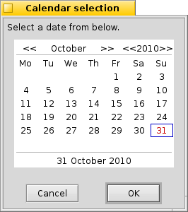

Shanty is a program for displaying dialog boxes from command line and scripts under [Haiku operating system](http://haiku-os.org/). It is almost compatible with [GNOME Zenity](http://live.gnome.org/Zenity).

This program is released under the MIT License (see the LICENSE file).

Installation
============

You can build Shanty by executing the **jam** command from inside the source directory.

Then you should copy the **shanty** executable to /boot/system/bin

Usage
=====

Shanty can be used to create simple graphical applications from scripts. It is possible to display information to the user and get input from the user.

In all dialogs you can test the return value to check if the user clicked on the *Cancel* button or closed the dialog.

For most of the dialogs, these general options are available:

    --title=TITLE               Set the dialog title
    --width=WIDTH               Set the width
    --height=HEIGHT             Set the height

  
Info, Warning, Error
--------------------

These dialogs are used to display simple alert to the user. Available options are:

    --info                      Display info dialog
    --warning                   Display warning dialog
    --error                     Display error dialog
    
    --text=TEXT                 Set the dialog text
    
Example:

	shanty --info --text 'Hello from Haiku!'
	

Question
--------

This dialog is used for asking a simple Yes/No question. Available options are:

    --question                  Display question dialog
    
    --text=TEXT                 Set the dialog text
    --ok-label=TEXT             Set the label of the Ok button
    --cancel-label=TEXT         Set the label of the Cancel button

You can test the return value, to see if the user answered *Yes*.

Example:

    if shanty --question --text "Is computer on?"; then
    	shanty --info --text="It seems it is."
    else
    	shanty --info --text="No it isn't."
    fi
    

Text entry
----------

This dialog allows you to get a single line of text from the user. Entered text is sent to standard output. Available options are:

    --entry                     Display text entry dialog
    
    --text=TEXT                 Set the dialog text
    --entry-text=TEXT           Set the entry text
    --hide-text                 Hide the entry text
    
Example:

    shanty --entry --title="Login" --text="Enter password:" --hide-text
    

    

Text information
----------------

This dialog displays multiline text. If the *filename* is not specified, text is read from the standard input. Available options are:

    --text-info                 Display text information dialog
    
    --filename=FILENAME         Open file
    --editable                  Allow changes to text

If invoked with the *--editable* option, text is sent to standard output.

Example:

    fortune | shanty --title="Fortune" --text-info
    

Calendar
--------

This dialog is used for selecting a date. Selected date is sent to standard output. Available options are:

    --calendar                  Display calendar dialog
    
    --text=TEXT                 Set the dialog text
    --day=DAY                   Set the calendar day
    --month=MONTH               Set the calendar month
    --year=YEAR                 Set the calendar year
    --date-format=PATTERN       Set the format for the returned date
    
 

File selection
--------------

This dialog is used for selecting files or directories. Available options are:

    --file-selection            Display file selection dialog
    
    --filename=FILENAME         Set the filename
    --multiple                  Allow multiple files to be selected
    --directory                 Activate directory-only selection
    --save                      Activate save mode
    --separator=SEPARATOR       Set output separator character

Progress
--------

This dialog indicates progress or activity. Input is read from the standard input. Lines containing a number (0-100) update the progress bar. Displayed text can be changed by starting a line with a # character, followed by the message.

    --progress                  Display progress indication dialog
    
    --text=TEXT                 Set the dialog text
    --percentage=PERCENTAGE     Set initial percentage
    --pulsate                   Pulsate progress bar
    --auto-close                Dismiss the dialog when 100% has been reached
    --auto-kill                 Kill parent process if cancel button is pressed
    --no-cancel                 Hide the Cancel button
    
If invoked with the *--pulsate* option, dialog only indicates activity, until an EOF character is read from input.

Scale
-----

This dialog is used for selecting a value using a slider. Selected value is sent to standard output. Available options are:

    --scale                     Display scale dialog
    
    --text=TEXT                 Set the dialog text
    --value=VALUE               Set initial value
    --min-value=VALUE           Set minimum value
    --max-value=VALUE           Set maximum value
    --step=VALUE                Set step size
    --print-partial             Print partial values
    --hide-value                Hide value

List
----

Not yet implemented...

Notification icon
-----------------

Not yet implemented...

